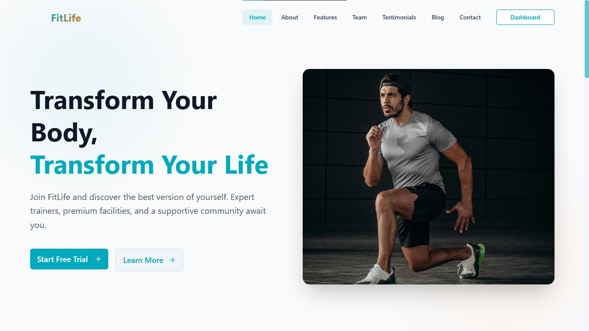
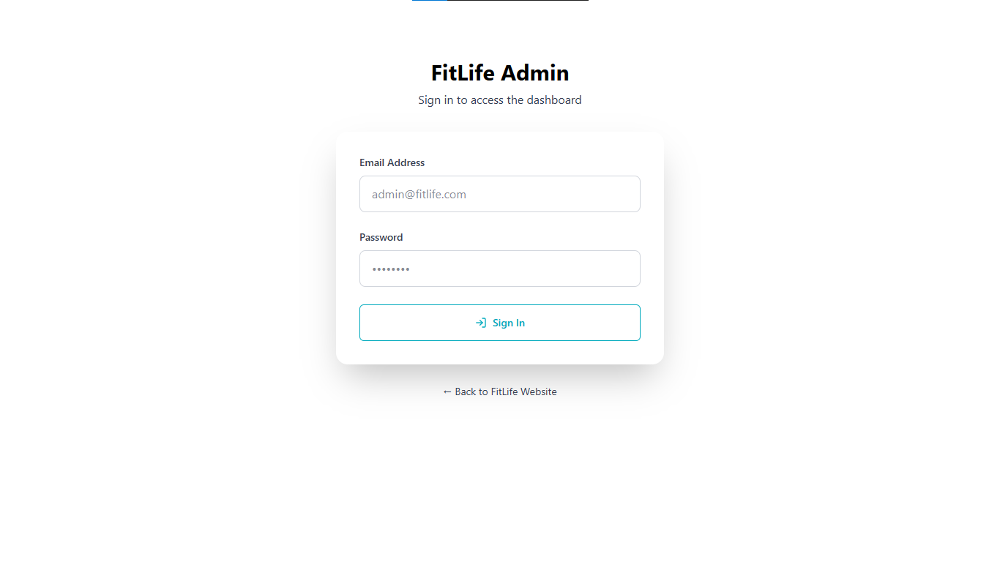
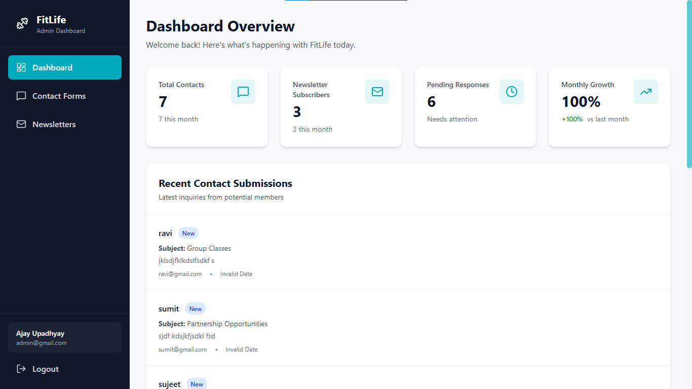
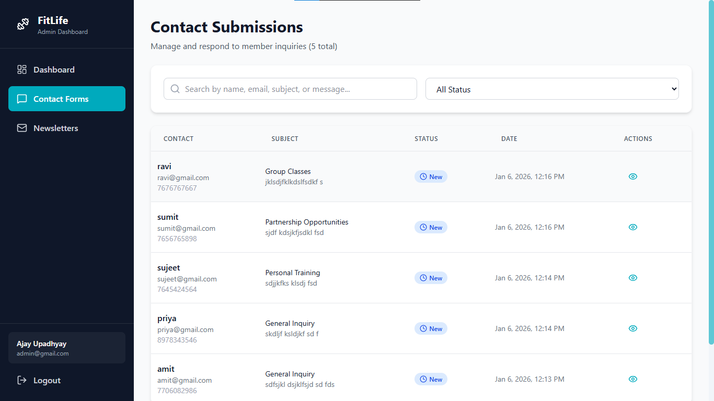

# FitLife - Fitness Website

A modern, responsive fitness website built with React, TypeScript, Tailwind CSS, and shadcn/ui.

## 🎨 Features

- **7 Complete Pages**: Home, About, Features, Team, Testimonials, Blog, and Contact
- **Responsive Design**: Mobile-first approach that works on all devices
- **Eye-Friendly Colors**: Energetic cyan and orange color scheme designed for comfortable viewing
- **TypeScript**: Fully typed for better development experience
- **Modern UI**: Built with shadcn/ui components for a polished look
- **Smooth Animations**: Engaging transitions and hover effects
- **SEO Ready**: Semantic HTML structure

## 🚀 Setup Instructions

### Prerequisites

- Node.js (v16 or higher)
- npm or yarn

### Step 1: Clone repo
```bash
git clone repo_url
```

### Step 2: Install Dependencies

If you haven't already, install the required packages:

```bash
npm install react-router-dom
npm install lucide-react
```

### Step 3: Update Your Project
```bash
JWT_SECRET=abcd
MONGO_URL=mongodb://localhost:27017
NODE_ENV=development
PORT=3000
VITE_API_BE_URL=http://localhost:3000
``` 

### Step 4: Run the Development Server

```bash
npm run dev
```

website live link:- `https://fitness-website-zcnl.onrender.com`

## 📱 Pages Overview

### 1. Home Page

- Hero section with CTA buttons
- Stats showcase (5000+ members, 50+ trainers, etc.)
- Features preview grid
- Benefits section
- Call-to-action

### 2. About Page

- Company story
- Mission & Vision cards
- Core values (Passion, Community, Excellence, Integrity)
- Timeline of milestones

### 3. Features Page

- Detailed feature sections (Equipment, Classes, Training, Nutrition)
- Additional benefits grid
- Specialized training programs
- Call-to-action

### 4. Team Page

- Trainer profile cards with initials avatars
- Social media links (Instagram, Twitter, LinkedIn)
- Team statistics
- Expert qualifications

### 5. Testimonials Page

- Success statistics
- Client testimonial cards with ratings
- Video testimonial placeholders
- Average member results

### 6. Blog Page

- Featured article section
- Category filtering
- Blog post grid with categories
- Newsletter subscription

### 7. Contact Page

- Contact information cards
- Contact form with validation
- Map placeholder
- Operating hours

## 📦 Built With

- **React 18** - UI library
- **TypeScript** - Type safety
- **Tailwind CSS** - Utility-first CSS
- **shadcn/ui** - Component library
- **React Router** - Navigation
- **Lucide React** - Icons
- **Vite** - Build tool
- **Nodejs** - Backend
- **Express** - Server
- **Mongodb** - Database


## 🎯 Key Features Implemented

✅ Fully responsive design
✅ Mobile navigation menu
✅ Smooth scrolling
✅ Hover animations
✅ Custom gradient backgrounds
✅ TypeScript typing throughout
✅ Reusable components
✅ SEO-friendly structure
✅ Form validation
✅ Social media integration
✅ Blog post filtering
✅ Testimonial ratings

## 📸 Screenshots

### 🏠 Home Feed


### 🔑 Login Page


### 🧑 Admin Dashboard




## Admin Credentials
```
Email :- admin@gmail.com
Password :- Admin@123
```

## 🤝 Support

For questions or issues:
+91 7706082986

## 📄 License

This project is created for commercial purposes.So please don't sell it.

